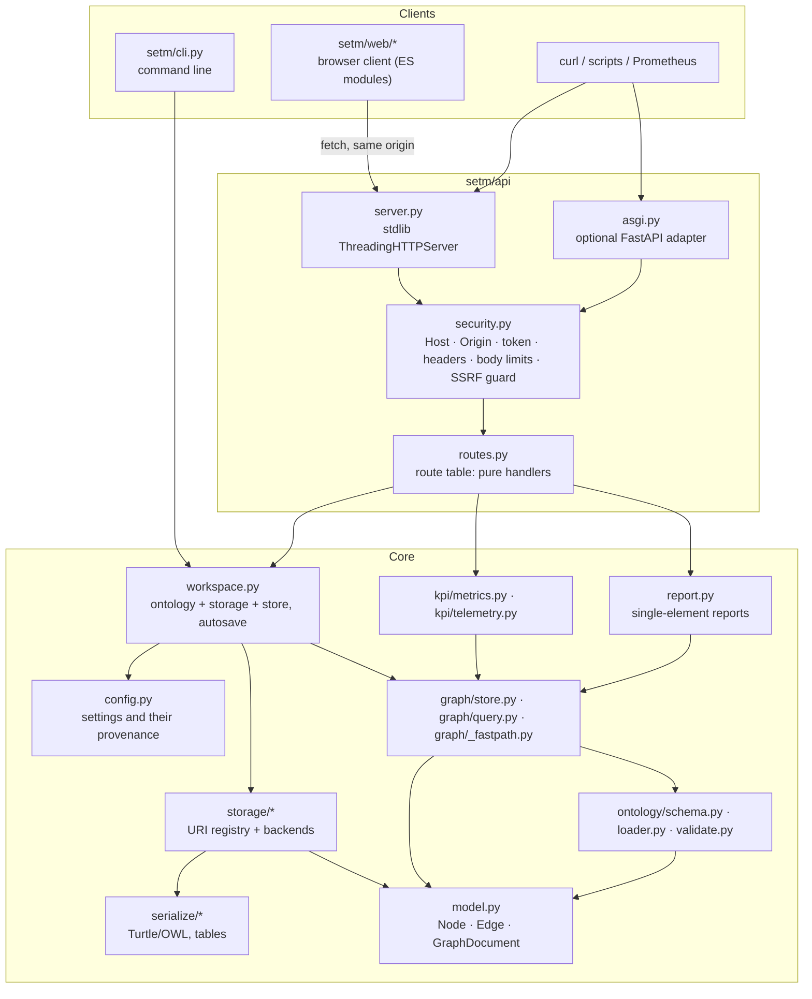
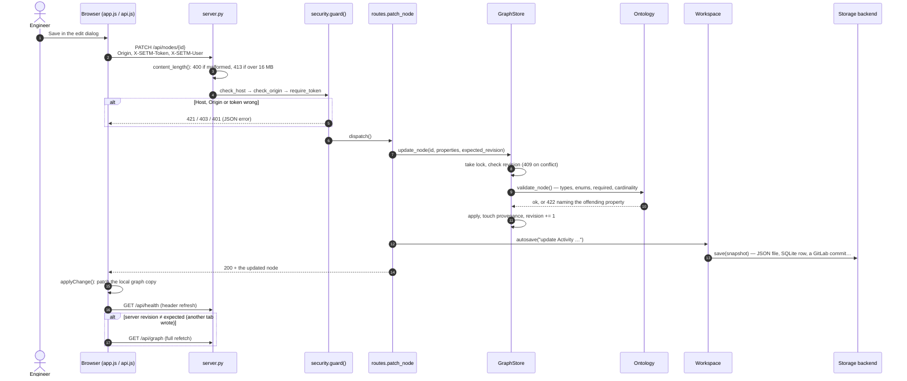
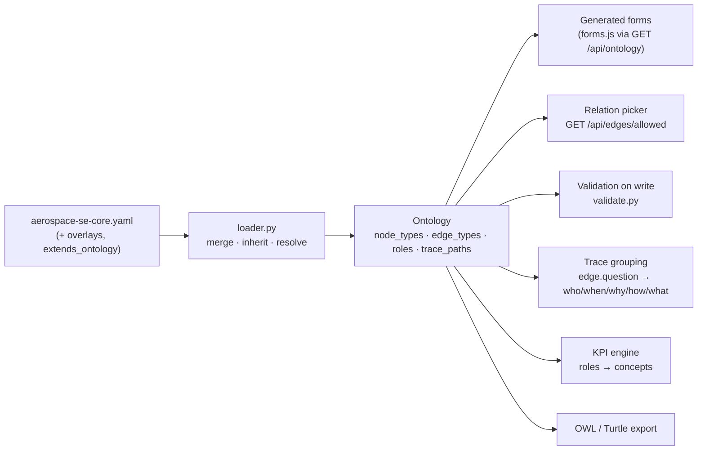
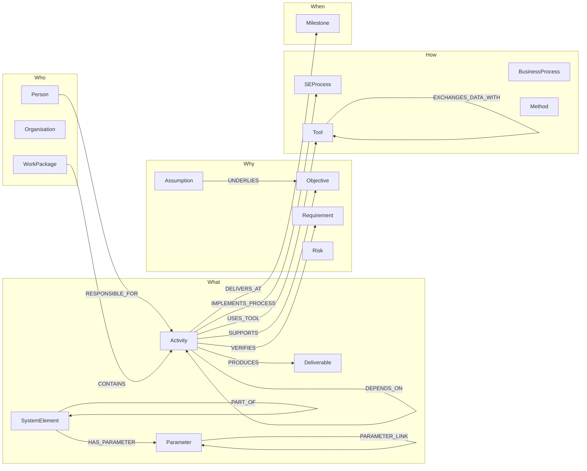
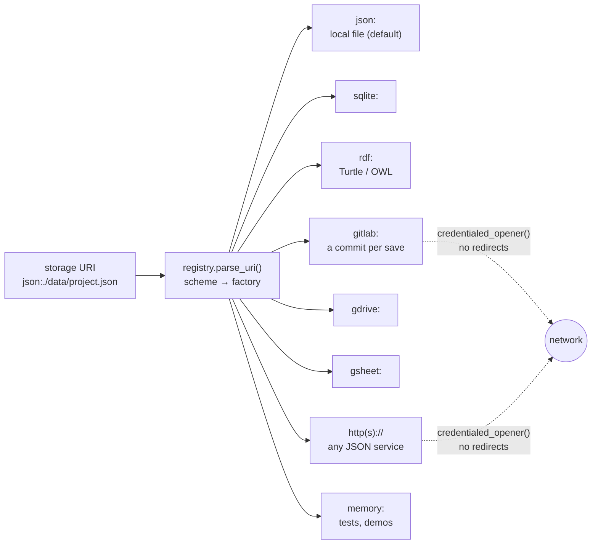
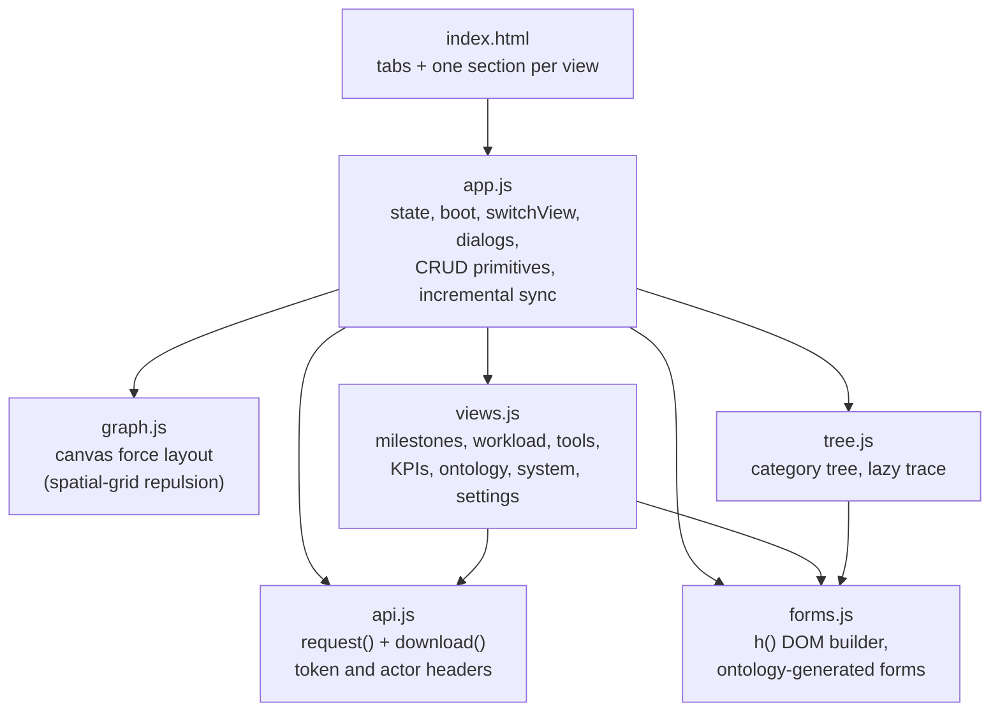
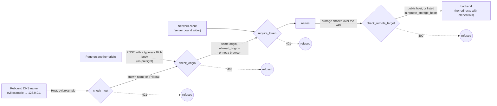

# SETM architecture

This document describes how the Systems Engineering Traceability Manager is
built. It covers the layers, how a request flows through them, how the ontology
drives the application, where data is stored, how the KPIs are computed, the
browser client, the security model and the performance characteristics. It
describes the code as it is; if the two disagree, the code is right and this
document needs fixing.

- [1. Principles](#1-principles)
- [2. Layers](#2-layers)
- [3. A request, end to end](#3-a-request-end-to-end)
- [4. The ontology drives everything](#4-the-ontology-drives-everything)
- [5. The data model](#5-the-data-model)
- [6. Storage](#6-storage)
- [7. The graph store](#7-the-graph-store)
- [8. KPI engine](#8-kpi-engine)
- [9. Browser client](#9-browser-client)
- [10. Security model](#10-security-model)
- [11. Performance](#11-performance)
- [12. Extension points](#12-extension-points)

---

## 1. Principles

| Principle | What it means in the code |
|---|---|
| **Standard library only** | The core runs on CPython alone. The HTTP server is `http.server`, the Turtle reader and writer are hand-written, and the frontend is plain ES modules with no build step and no CDN. Optional extras (PyYAML, FastAPI, rdflib, google-auth) are imported lazily, and if one is missing the error says how to install it. |
| **Ontology-driven, generic engine** | No element type, relation or KPI concept is hardcoded in the engine. `ontologies/aerospace-se-core.yaml` declares them, and routes, forms, validation, trace grouping and KPIs all read from it. |
| **Validate on write, in one place** | `GraphStore` checks every mutation against the ontology, so the UI, the API, the CLI and a bulk import all get the same guarantees. |
| **One route table, two servers** | Route handlers are plain functions of `(workspace, request)`. The stdlib server and the optional ASGI adapter serve the same table and share one security module. |
| **Provenance everywhere** | Every element and relation records who created and last changed it, a revision number and a source. Writes can pass an `expected_revision` for optimistic locking. |
| **Safe by default on a workstation** | The server binds to `127.0.0.1`. It accepts only its own host names and its own pages' origin. Secrets are never sent to the browser, and they are written to disk only on request, owner-readable. |

## 2. Layers

Each layer depends only on the layers below it. That is why adding a storage
backend or a KPI is a small change in one place.

| Module | Responsibility |
|---|---|
| `model.py` | `Node`, `Edge`, `GraphDocument`, `Provenance`: plain dataclasses with `to_dict` / `from_dict`. |
| `ontology/` | Loads YAML or JSON (`extends_ontology`, overlays, property sets, inheritance), resolves it into an `Ontology`, and validates nodes, edges and whole documents against it. It also owns the **cached type-reasoning layer**: `is_a`, `_type_matches` and `expectations_for`. |
| `graph/store.py` | The in-memory indexed graph. Every read and write takes the store's lock. `reading()` holds several reads to one revision. |
| `graph/query.py` | Traversals: trace, completeness, neighbourhood, paths, impact, cycles, orphans and induced subgraphs. |
| `graph/_fastpath.py` | Breadth-first hot paths, with an optional Rust (`rust/setm_core`) implementation behind the same signatures. |
| `storage/` | A `StorageBackend` interface, a URI-scheme registry, and backends for JSON, SQLite, RDF, GitLab, Google Drive and Sheets, generic HTTP, and memory. |
| `serialize/` | Turtle and OWL, both directions, plus spreadsheet tables. |
| `kpi/metrics.py` | 13 project KPIs and 7 breakdowns, all found through ontology roles. |
| `kpi/telemetry.py` | Counters, gauges and latency timers, shown on the System page and exposed at `/metrics`. |
| `workspace.py` | One open project: opens storage, builds the store, autosaves, imports, reloads, reconfigures. |
| `config.py` | Settings from defaults, `setm.toml`, the environment and flags, each recording which layer set it. The settings page is generated from `FIELD_SPECS`. |
| `api/security.py` | Every request-level defence, shared by both servers. See [section 10](#10-security-model). |
| `api/routes.py` | The route table. Handlers know nothing about sockets. |
| `api/server.py`, `api/asgi.py` | Transport: turn HTTP into a `Request`, run `guard()`, dispatch, and add security headers. |
| `web/` | The browser client. See [section 9](#9-browser-client). |

## 3. A request, end to end

This is what happens when someone edits an element in the browser.

Every response, including errors and static files, carries the security headers.
An unexpected exception becomes a generic 500. The detail goes to the server log
and is never sent to the client.

## 4. The ontology drives everything

The ontology file is maintained independently of the application. Change it,
press *Reload ontology*, and every form, relation picker, validation rule,
trace grouping and KPI follows. No code changes are needed.

What the ontology declares, and what uses each part:

- **Node types** have a `category` (Why, What, How, Who or When), properties
  (typed, with enums, units, required flags and UI hints), `extends`
  inheritance, and `include_properties` for shared property sets such as
  `lifecycle`.
- **Edge types** have a `domain` and `range` (which node types may be joined),
  a `cardinality`, a `question` (the management question the relation answers,
  which drives the trace panel and completeness) and optional properties such
  as `weight`.
  - Cardinality semantics: `one_to_one` and `many_to_one` make the source
    unique; `one_to_one` and `one_to_many` make the target unique.
  - Domain and range are the only constraint language. `PARAMETER_LINK` has
    both set to `Parameter`, and that is the whole of the "parameters link only
    to parameters" rule.
- **Roles** are an indirection map such as `activity: Activity` or
  `responsible: RESPONSIBLE_FOR`. The KPI engine and the frontend ask for a
  role, never a type name, so a programme that renames its vocabulary keeps
  working. If a role is missing, the KPIs that depend on it report
  `available: false` instead of failing.
- **Trace paths** are named chains of relation steps (with `~` for reverse),
  served at `/api/views/trace-path/{name}`.

**Cached type reasoning.** Questions such as "may an element of type X take part
in relation R" reduce to `is_a` walks up the `extends` chain. Computing KPIs over
a large graph asks them hundreds of thousands of times, but there are only a few
dozen distinct answers. So `Ontology` memoises three things:
- `is_a(type, ancestor)`;
- `_type_matches(type, allowed)`;
- `expectations_for(type)`, the per-type map of which questions an element is
  expected to answer and in which direction.

An ontology is treated as immutable once loaded; a reload builds a new object,
so the caches cannot go stale. `invalidate_caches()` exists for code that edits
one in place.

## 5. The data model

The shipped `aerospace-se-core` ontology arranges 16 element types, all
inheriting from an abstract `Thing`, in five management categories. The
relations between them answer who, when, why, how and what.

The diagram shows the principal relations; the ontology file declares 30.

**Worked examples** (`setm/examples.py` is the registry that both the CLI and
`/api/examples` read):

- **`payload`** is an Earth-observation payload programme (86 elements).
- **`modification`** is the "RENEW" mid-life modification of the fictional
  *Voyager LR* airframe (77 elements), with an obsolescence workstream and a
  performance workstream.
  - Both workstreams trace back to one **architecture baseline** produced by
    the activity `act.archbaseline`. That baseline is three `Deliverable`s of
    type `architecture_model`: the **Overall Aircraft Design (OAD)**, the
    **Outline Performance Diagram (OPD)** and the **Outline Systems Diagram
    (OSD)**.
  - The aircraft itself is a `PART_OF` tree of `SystemElement`s, with
    `Parameter`s attached through `HAS_PARAMETER` and linked to each other
    through `PARAMETER_LINK`. That is how a change to one performance parameter
    can be traced to the systems it affects.
  - OAD, OPD and OSD are example content, not ontology types, so another
    programme can describe its own architecture views the same way.

## 6. Storage

A storage target is a URI, resolved through a registry of schemes.

- Every backend implements `load()`, `save()`, `exists()`, `health()` and
  `describe()`, and declares its `capabilities` (read, write, remote, history).
- `Workspace.save()` is serialised by a lock. It is a no-op when nothing
  changed. With `autosave` on, every write is flushed; on a versioned backend
  that means one commit per change.
- The GitLab backend remembers the commit it loaded. A save that finds someone
  else committed in between fails with a conflict instead of overwriting.
- Credentialed backends (`gitlab`, `http`) refuse HTTP redirects, so a token is
  never forwarded to a host it was not meant for.

## 7. The graph store

`GraphStore` holds the authoritative copy of the graph while the process runs.

- **Indices** are dicts of sets: nodes by id, edges by id, outgoing and incoming
  edge ids per node, and node and edge ids per type. Reads are dictionary
  lookups. A write costs O(degree) plus validation.
- **Cardinality** is checked against the two endpoints' own indices rather than
  by rescanning every edge of the type, which keeps bulk import linear.
- **Queries built for the hot paths:**
  - `has_edge()` and `edge_types_at()` answer "does this node have an X
    relation" without building lists.
  - `edges_among()` returns an induced edge set. For a small selection it walks
    each node's adjacency; for most of the graph it does one pass over all
    edges.
  - `find_nodes()` caches each node's lower-cased search text, and a write to
    that node clears the cache entry.
- **Concurrency.** The HTTP server gives each request its own thread.
  - Every store method takes one re-entrant lock, so a read can never trip over
    a concurrent write. Before this change, reads were unlocked and could fail
    with `dictionary keys changed during iteration`.
  - Callers that need several reads to agree, such as a KPI report or a graph
    payload, wrap them in `with store.reading():`.
  - Replacing the whole store (reload, import, ontology reload) happens under
    the workspace's save lock. The old store is held while its snapshot is
    taken.
- **Scaling rule: one writer process.** The graph is in-memory per process, so
  several writable workers would diverge. Threads handle concurrency;
  read-only replicas can be scaled freely.

## 8. KPI engine

`compute_kpis()` finds every concept through ontology roles and returns 13
KPIs. Each has a `value`, a `target`, a direction, a band (good, watch or poor)
and a `detail` payload that names the offending elements, so a red number leads
straight to the gap. It also returns a composite health score and 7 breakdowns:
by milestone, person, work package, status, type, weight and tool.

Design points:

- Traceability completeness is computed **once per activity** and shared by the
  three KPIs and the work-package breakdown that need it.
- Completeness for an element comes from `expectations_for(type)`, which is
  cached per type, plus the element's own relation types from `edge_types_at()`.
- The whole computation runs under `store.reading()`, so every KPI sees the same
  revision.
- Targets come from `DEFAULT_TARGETS`, overridden per programme through the
  `kpi_targets` setting.

## 9. Browser client

The client is plain ES modules served from `setm/web/`, with no framework,
bundler or third-party code.

- **Rendering is XSS-safe by construction.**
  - `h()` puts text in through `textContent` or text nodes.
  - It has no `innerHTML` path; that branch was removed as a latent risk even
    though nothing used it.
  - The CSP also forbids inline and foreign scripts.
- **Views** follow one convention:
  - a renderer takes `(container, data, actions)`;
  - `app.js` owns the create, edit and delete primitives and passes them in;
  - a new view needs a tab, a `<section class="view">`, and an entry in the
    `display:block` override list in `style.css`.
- **Incremental sync.**
  - After a single add, edit or delete, `applyChange()` patches the local graph
    from the server's response instead of re-downloading the whole graph.
    Relations, and the relations removed with a deleted element, are patched
    the same way.
  - The header refresh that follows returns the server's revision. If another
    tab or user wrote in between, the client falls back to a full refetch.
  - Imports, example loads and reloads always refetch.
- **Downloads** (exports, ontology files, reports, report previews) go through
  `api.download()`. It is a `fetch` with the token header, followed by a blob
  save or a new tab, so they work when an API token is set. Plain links could
  not send the header and returned 401.

## 10. Security model

**Deployment assumption:** SETM is a local web application. By default it binds
to `127.0.0.1` without a token, and every page it serves can change the graph.
The threats that matter most are the ones that come through the user's own
browser:
- a web page on another origin attacking a server on `localhost`;
- a request forged to make the server reach an internal host.

After those comes anyone on the network, if the server is bound wider.

| Threat | Defence | Where |
|---|---|---|
| **Cross-site request forgery.** A page the user has open POSTs to `127.0.0.1`. Verified: on the previous version, a page on another origin created an element with a typeless-`Blob` `fetch`. | State-changing methods need an `Origin` that matches the server or is listed in `allowed_origins`. Without an `Origin`, `Sec-Fetch-Site` must be same-origin or absent, which is how curl and scripts are recognised. | `security.check_origin` |
| **DNS rebinding.** An attacker's domain is re-pointed at `127.0.0.1`, making the API same-origin with the attacker's page. | `Host` must be loopback, an IP literal (rebinding needs a name), the machine's own name, the configured host, or listed in `allowed_hosts`. Anything else gets 421, on static files too. | `security.check_host` |
| **Server-side request forgery.** The settings page names an internal URL, and the server fetches it. | Storage targets set over the API may not resolve to private, loopback or link-local addresses unless listed in `remote_storage_hosts`. Metadata addresses need explicit listing. Storage set on the CLI, in the environment or in `setm.toml` is the operator's own choice and is not restricted. | `security.check_remote_target` |
| **Credential leak to a caller-chosen host.** | `SETM_GITLAB_TOKEN` and `SETM_HTTP_TOKEN` are sent only to the host they were configured for; for any other host the caller must supply a token. Credentialed backends refuse redirects. | `check_remote_target`, `storage.base.credentialed_opener` |
| **Token guessing or leakage.** | Constant-time comparison (`hmac.compare_digest`). Only the `X-SETM-Token` header is accepted, never `?token=`, which would end up in logs and history. `/metrics` is behind the token. | `security.require_token` |
| **Content injection and framing.** | CSP (`script-src 'self'`, `object-src 'none'`, `frame-ancestors 'none'`, `base-uri 'none'`), `X-Content-Type-Options: nosniff`, `Referrer-Policy: no-referrer`, `X-Frame-Options: DENY` and `Cross-Origin-Opener-Policy`. The DOM builder has no `innerHTML`, and reports HTML-escape every value. | `security.SECURITY_HEADERS`, `forms.js`, `report.py` |
| **Malformed or oversized requests.** | `Content-Length` is parsed strictly (400). Bodies over 16 MB are refused before they are read (413). | `security.content_length` |
| **Information disclosure.** | Unexpected errors return a generic 500 and are logged server-side. Secrets are redacted before they reach the browser. | `routes.error_response`, `Settings.redacted` |
| **Secrets at rest.** | A `setm.toml` written with secrets is created mode `0600` from the start. | `Settings.save_file` |
| **Metrics injection.** | Prometheus label names are sanitised and label values escaped. | `telemetry._prom_label_*` |
| **Path traversal.** | Static paths are resolved and must stay inside `setm/web` (403 otherwise). This was already sound and has not changed. | `server._serve_static` |

Accepted residual risks:
- `X-SETM-User` is a self-declared author name for provenance, not
  authentication. Use a token, and a reverse proxy with real authentication,
  when attribution must be trusted.
- A bound-wide server without a token is open to anyone who can reach it. The
  settings page says so next to the bind-address field.

## 11. Performance

Measured on a synthetic programme of **6,468 elements and 26,857 relations**
(single CPython 3.11 process, no Rust extension, best of several runs), before
and after the restructuring:

| Operation | Before | After | Speed-up |
|---|---:|---:|---:|
| Full KPI report (`GET /api/kpi`) | 557 ms | 286 ms | 1.9× |
| Traceability completeness, all 6,000 activities | 309 ms | 63 ms | 4.9× |
| Full graph read (`GET /api/graph`, what the UI loads) | 38 ms | 25 ms | 1.5× |
| Free-text search (`GET /api/nodes?q=`) | 3.2 ms | 0.95 ms | 3.4× |
| Neighbourhood of a milestone, depth 1 | 3.1 ms | 2.1 ms | 1.5× |
| Browser: data fetched after editing one element | whole graph + header | header only | — |

Where the time went, and what changed:

1. **Repeated type reasoning.** `completeness()` rebuilt the same per-type
   expectation map for every activity, calling `is_a` 342,060 times for one
   report. The map is now computed once per type (`Ontology.expectations_for`),
   and `is_a` and `_type_matches` are memoised.
2. **Lists built only to test for emptiness.** The KPI checks ("has this activity
   an owner, a milestone, a tool…") now use `GraphStore.has_edge()`, and
   completeness uses `edge_types_at()`.
3. **Subgraphs that scanned every edge.** `query.subgraph()` scanned the whole
   graph even for a 30-node neighbourhood. `/api/graph` scanned all edges three
   times and reported a count that could disagree with its own payload. Both
   now go through `edges_among()`, which is one pass, and the counts come from
   the payload itself.
4. **Search text rebuilt on every query.** `find_nodes()` now caches each node's
   haystack.
5. **The browser re-downloaded everything after each click.** Incremental sync
   ([section 9](#9-browser-client)) replaces that with the write's own response.

Correctness is guarded rather than assumed. The before and after KPI reports,
completeness maps and subgraphs are byte-identical on the synthetic graph and on
both shipped examples. `tests/test_performance.py` checks each optimisation
against the plain computation it replaced. A threaded stress test reproduces the
old unlocked-read failure on the previous code and passes on this one.

Beyond this scale, `rust/setm_core` accelerates breadth-first traversal behind
the same API (`_fastpath.py` picks it up if it is installed). `setm.api.asgi`
runs under uvicorn for TLS and process management, with one writer process.

## 12. Extension points

| To add… | Change | Nothing else, because… |
|---|---|---|
| An element or relation type, a property, an enum value | the ontology YAML, or an overlay | routes, forms, validation, trace and export are all generic |
| A KPI | a function in `kpi/metrics.py`, plus a `DEFAULT_TARGETS` entry | the page renders whatever the report returns; add a `roles` entry if the KPI needs a new concept |
| A storage backend | a `StorageBackend` subclass and `register("scheme", …)` | the workspace, the settings page and `test-storage` go through the registry |
| An API route | an `@router.route(...)` handler in `routes.py` | both servers, the security guard and telemetry wrap every route |
| A worked example | a builder function and an entry in `setm/examples.py` | the CLI `--example` choices and the Settings loader read the registry |
| A setting | a `FieldSpec` in `config.py` and a `Settings` field | the settings page, `setm.toml` and the environment layer are generated from it |
| A view | a renderer in `views.js`, a tab and a section in `index.html`, and the CSS override list | `switchView` and the `actions` object are shared |
